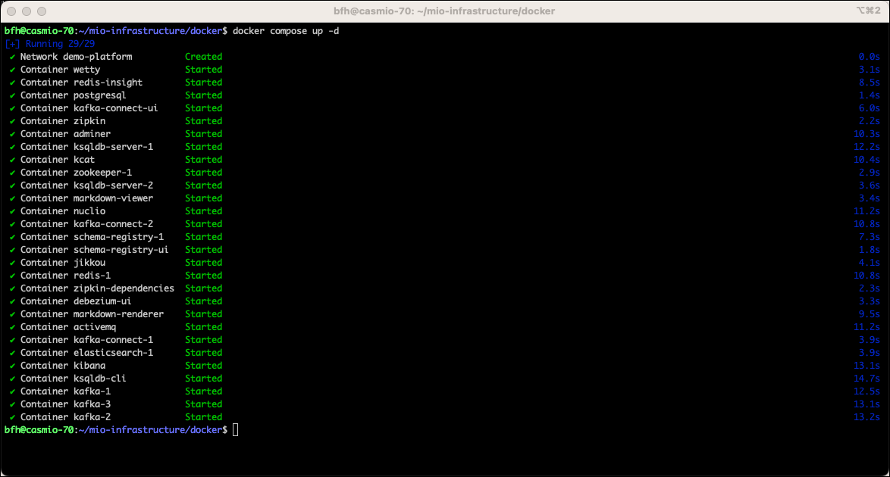
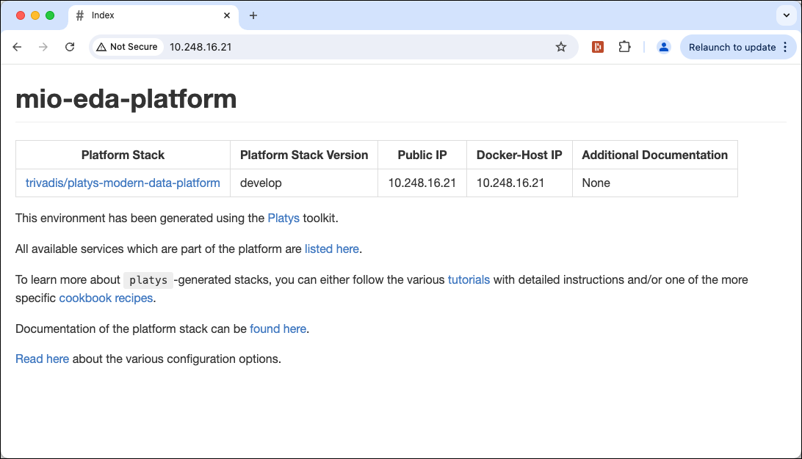
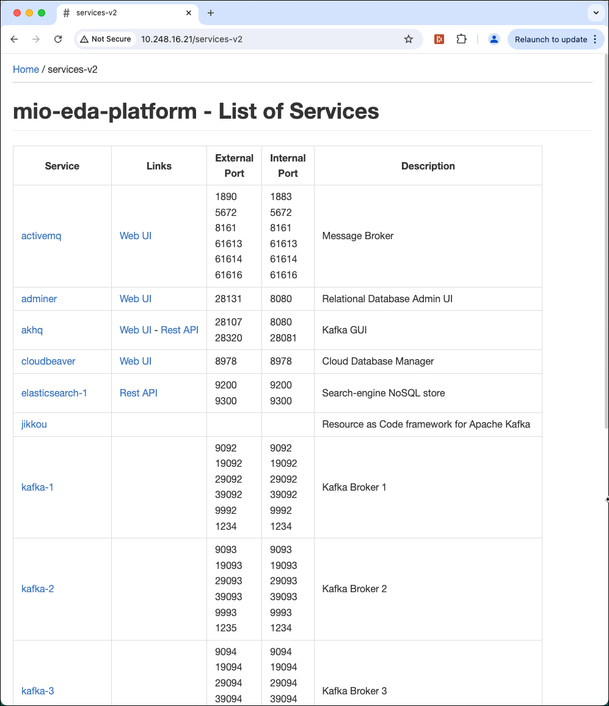
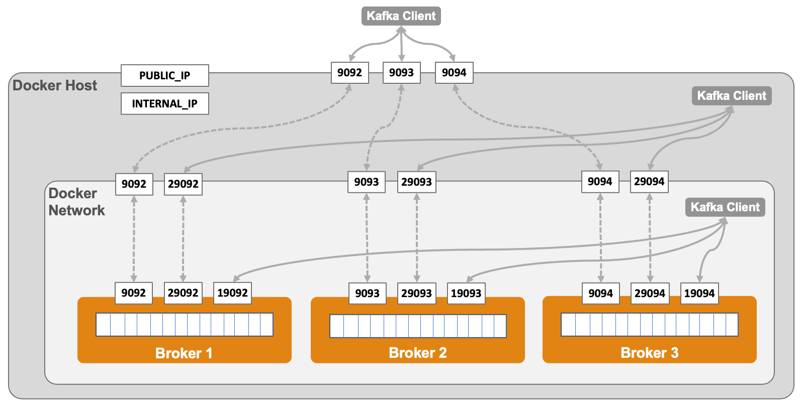

# MIO-EDA: Setup Infrastructure on Ubuntu Linux

This document describes how to install the necessary container-based environment for the EDA module on a Ubuntu Machine, which could be running in a virtual machine, either in the cloud, on a remote server or on your local machine.

The VM should be configured with at least 12 GB and 4 CPUs.

## Setup Software

First let's create some environment variables.   

```bash
export GITLAB_PROJECT=mio-infrastructure
export DATAPLATFORM_HOME=docker
export NETWORK_NAME=<network-name>
```

**Note:** Make sure to replace the `<network-name>` by the value retrieved from `ip addr`, which would be `ens160` in the example below

```
$ ip addr
1: lo: <LOOPBACK,UP,LOWER_UP> mtu 65536 qdisc noqueue state UNKNOWN group default qlen 1000
    link/loopback 00:00:00:00:00:00 brd 00:00:00:00:00:00
    inet 127.0.0.1/8 scope host lo
       valid_lft forever preferred_lft forever
2: ens160: <BROADCAST,MULTICAST,UP,LOWER_UP> mtu 1500 qdisc mq state UP group default qlen 1000
    link/ether 00:50:56:99:2e:cb brd ff:ff:ff:ff:ff:ff
    altname enp3s0
    inet 147.87.118.70/24 brd 147.87.118.255 scope global ens160
       valid_lft forever preferred_lft forever
```    

### Install some helpful utilities

Let's install some useful utilities:

```bash
sudo apt-get install -y curl jq kafkacat unzip nano postgresql-client
```

### Install Docker (skip if already available)

Check with `docker -v` if it is already available.

The instructions below are taken from here: <https://docs.docker.com/engine/install/ubuntu/>

**Setup the repository**

Uninstall old versions

```bash
for pkg in docker.io docker-doc docker-compose docker-compose-v2 podman-docker containerd runc; do sudo apt-get remove $pkg; done
```

Set up Docker's apt repository.

```bash
# Add Docker's official GPG key:
sudo apt-get update
sudo apt-get install ca-certificates curl
sudo install -m 0755 -d /etc/apt/keyrings
sudo curl -fsSL https://download.docker.com/linux/ubuntu/gpg -o /etc/apt/keyrings/docker.asc
sudo chmod a+r /etc/apt/keyrings/docker.asc

# Add the repository to Apt sources:
echo \
  "deb [arch=$(dpkg --print-architecture) signed-by=/etc/apt/keyrings/docker.asc] https://download.docker.com/linux/ubuntu \
  $(. /etc/os-release && echo "$VERSION_CODENAME") stable" | \
  sudo tee /etc/apt/sources.list.d/docker.list > /dev/null
sudo apt-get update
```    

**Install Docker Engine**

To install the latest version, run:

```bash    
sudo apt-get install docker-ce docker-ce-cli containerd.io docker-buildx-plugin docker-compose-plugin
```

Add user to `docker` group

```bash    
sudo usermod -aG docker $USER
```

run the following command to activate the changes to groups

```bash
newgrp docker
```

**Test if docker is working**

```bash
docker -v

docker ps
```

### Installing Docker Compose Switch (skip if you are fine with docker compose syntax)

[Compose Switch](https://github.com/docker/compose-switch) is a replacement to the Compose V1 docker-compose (python) executable.

Download compose-switch binary for your architecture:

```bash
sudo curl -fL https://github.com/docker/compose-switch/releases/latest/download/docker-compose-linux-amd64 -o /usr/local/bin/compose-switch
```

Make compose-switch executable:

```bash
sudo chmod +x /usr/local/bin/compose-switch
```

Define an "alternatives" group for docker-compose command

```
sudo update-alternatives --install /usr/local/bin/docker-compose docker-compose /usr/local/bin/compose-switch 99
```

### Installing Platys

Installing `platys` is optional. It is an [open source tool](http://github.com/trivadispf/platys) which we have used to generate the docker-compose stack we will use below.

```bash
sudo curl -L "https://github.com/TrivadisPF/platys/releases/download/2.4.3/platys_2.4.3_linux_x86_64.tar.gz" -o /tmp/platys.tar.gz
tar zvxf /tmp/platys.tar.gz 
sudo mv platys /usr/local/bin/
sudo chown root:root /usr/local/bin/platys
sudo rm README.md 
```

Test that `platys` is working

```bash
platys -v
```

## Prepare Environment

In a terminal window execute the following commands. 

### Setup environment variables

If your virtual machine is running in the cloud or on a remote server, set the `PUBLIC_IP` variable to the IP Address you use to reach it

```bash
export PUBLIC_IP=<public-ip>
```

otherwise this command (make sure that `$NETWORK_NAME` has been set correctly)

```bash
export PUBLIC_IP=$(ip addr show $NETWORK_NAME | grep "inet\b" | awk '{print $2}' | cut -d/ -f1)
```

Additionally set the `DOCKER_HOST_IP` to the IP address of the machine (make sure that `$NETWORK_NAME` has been set correctly)

```bash
export DOCKER_HOST_IP=$(ip addr show $NETWORK_NAME | grep "inet\b" | awk '{print $2}' | cut -d/ -f1)
```

### Check that variables have correct values

Print the content of the two variables using `echo`

```bash
echo "PUBLIC_IP = $PUBLIC_IP and DOCKER_HOST_IP = $DOCKER_HOST_IP"
```

should return a result similar to the one below

```
bfh@casmio-70:~$ echo "PUBLIC_IP = $PUBLIC_IP and DOCKER_HOST_IP = $DOCKER_HOST_IP"
PUBLIC_IP = 147.87.118.70 and DOCKER_HOST_IP = 147.87.118.70
```

just with another IP address. If it is not the case, fix the problem first, before you continue. 

### Clone Workshop GitHub project

Now let's clone the Kafka Workshop project from GitHub:

```
cd 
git clone git@gitlab.ti.bfh.ch:cas-mio-fs24/eda/infrastructure/${GITLAB_PROJECT}.git
cd ${GITLAB_PROJECT}/docker
export DATAPLATFORM_HOME=$PWD
```

### Persist Environment variables

Finally let's persist the 3 environment variables `PUBLIC_IP`, `DOCKER_HOST_IP` and `DATAPLATFORM_HOME`, so that they are available after a logout.

```bash
printf "export PUBLIC_IP=$PUBLIC_IP\n" >> /home/$USER/.bash_profile
printf "export DOCKER_HOST_IP=$DOCKER_HOST_IP\n" >> /home/$USER/.bash_profile
printf "export DATAPLATFORM_HOME=$DATAPLATFORM_HOME\n" >> /home/$USER/.bash_profile
printf "\n" >> /home/$USER/.bash_profile
printf "alias kcat=kafkacat\n" >> /home/$USER/.bash_profile
printf "\n" >> /home/$USER/.bash_profile
sudo chown ${USER}:${USER} /home/$USER/.bash_profile
```

### Add `dataplatform` to `etc/hosts`

In order to not have to use and know the IP address in all the workshops, we add an alias to the `/etc/hosts` file:

```bash
echo $PUBLIC_IP dataplatform | sudo tee -a /etc/hosts
``` 

### Settings for Elasticsearch

For Elasticsearch to run properly, we have to increase the `vm.max_map_count` parameter like shown below.  

```bash
sudo sysctl -w vm.max_map_count=262144   
```

## Start Environment

Start the environment by performing a `docker compose up`

```
docker compose up -d
```

If started the first time, the necessary docker images will be downloaded from the public docker registry. Therefore you need internet access from your machine.

Depending on the speed of the network, the download takes a few minutes (around 5 minutes).

Once this is done, the docker container will start one by one, and at the end the output should be similar to the one below. 



Your instance is now ready to use. 

In a web browser navigate to `http://<public-ip>` to access the markdown page with the relevant information about the docker compose stack.



Click on link **All available services which are part of the platform are listed here** to navigate to the list of services:




### Kafka Infrastructure Setup

The following diagram shows the setup of the Kafka cluster with the 3 brokers, and the ports they advertise inside the docker network as well as outside.



## Stop environment

To stop the environment, execute the following command:

```
docker compose stop
```

after that it can be re-started using `docker-compose start`.

## Remove the environment

To stop and remove all running container, execute the following command:

```
docker compose down
```


